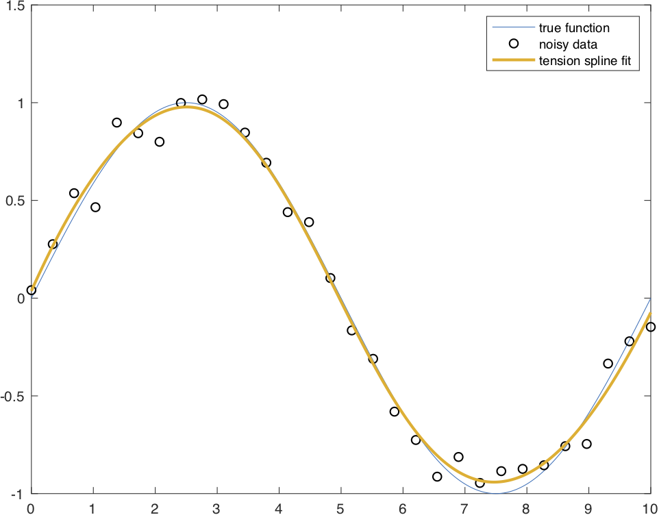

Interpolating splines, tension splines and b-splines 
==============

A series of classes for interpolating and smoothing data using b-splines.

The `InterpolatingSpline` class is useful for interpolating between points when the data is not noisy, while the `TensionSpline` class is useful for smoothing noisy data. Both classes are subclasses of `BSpline`, which can be used to generate b-splines from any set of knot points. 

### Table of contents
1. [Quick Start](#quick-start)
2. [Interpolating Spline](#interpolating-spline)

------------------------

Quick start
------------

The `InterpolatingSpline` class is useful for interpolating smooth functions. Initialize with data (x,y),
```matlab
x = linspace(0,20,10)';
y = sin(2*pi*x/10);
spline = InterpolatingSpline(t,x)
```
and now you can evaluate the interpolated value,
```matlab
x_dense = linspace(0,20,100)';
y_dense = spline(x_dense);
```
By default the class uses cubic spline, but you can initialize with whatever order of spline you want, e.g.,
```matlab
spline = InterpolatingSpline(t,x,'K',5)
```

If your data is noisy, you'll want to use the `TensionSpline` class instead. In this example we sample a smooth function (sine) and contaminate it Gaussian noise,
```matlab
N = 30;
L = 10;
sigma = 0.1;

x = linspace(0,L,N)';
y = sin(2*pi*x/L) + sigma*randn(N,1);
```
and then initialize the `TensionSpline` class with the data and the standard deviation of the noise,
```matlab
spline = TensionSpline(x,y,sigma)
```
That's it! The `spline` object can be evaluated at any point in the domain, just as with the interpolating spline class.

Interpolating spline
------------

An interpolating spline uses local b-splines to interpolate across points. The (K-1)th derivative of a K order spline is piecewise continuous.
Let's start by defining a  function,
```matlab
L = 10;
f = @(x) sin(2*pi*x/L);
```
create a grid of observation points,
```matlab
N = 10;
x = linspace(0,2*L,N)';
```
and then sampling the function at the observation points
```matlab
y = f(x);
```
Let's create a dense grid in x just to better visualize the true function, and the sample points.
```matlab
x_dense = linspace(0,2*L,10*N)';

figure
plot(x_dense,f(x_dense)), hold on
scatter(x,y,'k')
legend('true function', 'observations')
```
Finally, let's use an interpolating spline,
```matlab
spline = InterpolatingSpline(x,y);

figure
plot(x_dense,f(x_dense)), hold on
scatter(x,y,'k')
plot(x_dense,spline(x_dense))
legend('true function', 'observations', 'spline fit')
```
This spline fit is identical to Matlab's built in griddedInterpolant with the 'spline' option,
```matlab
ginterp = griddedInterpolant(x,y,'spline');

residual = ginterp(x_dense)-spline(x_dense);
relative_error = max(abs(residual))/max(abs(y)) % returns O(1e-16)
```
However, unlike Matlab's implementation, this class lets you specify the order of the spline to something other than cubic (K=4). For example, we can do a K=2 fit (which is just linear interpolation), but also a (K=5) fit.
```matlab
spline_2 = InterpolatingSpline(x,y,'K',2);
spline_5 = InterpolatingSpline(x,y,'K',5);

figure
plot(x_dense,f(x_dense)), hold on
scatter(x,y,'k')
plot(x_dense,spline_2(x_dense))
plot(x_dense,spline_5(x_dense))
legend('true function', 'observations', 'spline fit, K=2', 'spline fit, K=5')
```

Tension spline
------------

A tension spline can be used to smooth noisy data and attempt to recover the "true" underlying function.

Let's start by defining a new function,
```matlab
L = 10;
f = @(x) sin(2*pi*x/L);
```
create a grid of observation points,
```matlab
N = 30;
x = linspace(0,L,N)';
```
and then sampling the function at the observation points while adding Gaussian noise,
```matlab
sigma = 0.1;
y = f(x) + sigma*randn(N,1);
```
Let's create a dense grid in x just to better visualize the true function, and then plot the function and noisy observations,
```matlab
x_dense = linspace(0,L,10*N)';

figure
plot(x_dense,f(x_dense)), hold on
scatter(x,y,'k')
legend('true function', 'noisy data')
```

Finally, let's use a tension spline to try to smooth the data and plot the results,
```matlab
spline = TensionSpline(x,y,sigma);

figure
plot(x_dense,f(x_dense)), hold on
scatter(x,y,'k')
plot(x_dense,spline(x_dense),'LineWidth',2)
legend('true function', 'noisy data', 'tension spline fit')
```

